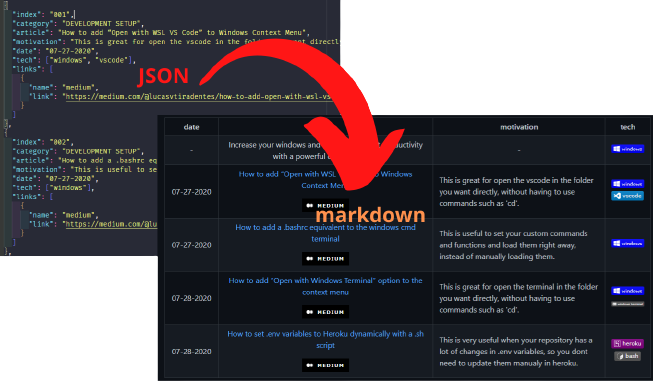

<a name="TOC"></a>

<div align="center">
  <a href="https://www.npmjs.com/package/markdown-helper"></a>
  <a href="https://nodejs.org/en/"></a>
  <a href="https://github.com/lucasvtiradentes/markdown-helper#contributing"></a><br>
  <a href="https://github.com/lucasvtiradentes/markdown-helper/actions/workflows/ci-cd.yml"></a>
  <a href="https://codecov.io/github/lucasvtiradentes/markdown-helper"></a>
</div>

<p align="center">
  <a href="#dart-features">Features</a> • <a href="#warning-requirements">Requirements</a> • <a href="#bulb-usage">Usage</a> • <a href="#wrench-development">Development</a> • <a href="#books-about">About</a>
</p>

<details>
  <summary align="center"><span>see <b>table of content</b></span></summary>
  <p align="center">
    <ul>
      <!-- <li><a href="#trumpet-overview">Overview</a></li> -->
      <!-- <li><a href="#pushpin-table-of-contents">TOC</a></li> -->
      <li><a href="#dart-features">Features</a></li>
      <li><a href="#warning-requirements">Requirements</a></li>
      <li>
        <a href="#bulb-usage">Usage</a>
        <ul>
          <li><a href="#installation">Installation</a></li>
          <li><a href="#available-methods">Available methods</a></li>
          <li><a href="#usage-example">Usage example</a></li>
        </ul>
      </li>
      <li>
        <a href="#wrench-development">Development</a>
        <ul>
          <li><a href="#development-setup">Development setup</a></li>
          <li><a href="#used-technologies">Used technologies</a></li>
        </ul>
      </li>
      <li>
        <a href="#books-about">About</a>
        <ul>
          <li><a href="#related">Related</a></li>
          <li><a href="#license">License</a></li>
          <li><a href="#feedback">Feedback</a></li>
        </ul>
      </li>
    </ul>
  </p>
</details>

<a href="#"></a>

## :trumpet: Overview

Easily handle dynamic fields in markdown files, such as quantity fields or even tables in nodejs based projects.

<div align="center"></div>

## :dart: Features<a href="#TOC"></a>

&nbsp;&nbsp;&nbsp;✔️ easily add, update or remove markdown fields (numbers, tables, etc);<br>
&nbsp;&nbsp;&nbsp;✔️ powerful and simple way to deal with tables;<br>
&nbsp;&nbsp;&nbsp;✔️ allow you to see the current content before you update the file;<br>
&nbsp;&nbsp;&nbsp;✔️ allow you to see which dynamic fields were found;<br>
&nbsp;&nbsp;&nbsp;✔️ provides an easy way to get content form json files;<br>
&nbsp;&nbsp;&nbsp;✔️ works in typescript, javascript commonjs and javascript modules.<br>

## :warning: Requirements<a href="#TOC"></a>

In order to use this project in your computer, you need to have the following items:

- [npm](https://www.npmjs.com/): To install the package. Npm is installed alongside nodejs;
- [nodejs](https://nodejs.org/en/): To actually run the package.

## :bulb: Usage<a href="#TOC"></a>

### Installation

To install `markdown-helper` in your computer, simple run this command:

```bash
# install the markdown-helper npm package
$ npm install markdown-helper
```

### Available methods

The `markdown-helper` comes with the following commands list:

<table>
  <tr>
    <th>Exported</th>
    <th>Command</th>
    <th>Description</th>
  </tr>
  <tr>
    <td rowspan="7">DynMarkdown</td>
    <td><code>.markdownContent</code></td>
    <td>Access the current markdown file content.</td>
  </tr>
  <tr>
    <!-- <td rowspan="6">DYNFIELD</td> -->
    <td><code>.fields</code></td>
    <td>Shows the dynamic fields found on the specified file.</td>
  </tr>
  <tr>
    <!-- <td rowspan="1">markdown-helper</td> -->
    <td><code>.updateField(field, newContent)</code></td>
    <td>updates the field with the newContent provided.</td>
  </tr>
  <tr>
    <!-- <td rowspan="1">markdown-helper</td> -->
    <td><code>.deleteField(field)</code></td>
    <td>delete an existing field in the markdown content.</td>
  </tr>
  <tr>
    <!-- <td rowspan="1">markdown-helper</td> -->
    <td><code>.addSection(content, position, searchedLine?)</code></td>
    <td>add a content to a specific position in the markdown.</td>
  </tr>
  <tr>
    <!-- <td rowspan="1">markdown-helper</td> -->
    <td><code>.saveFile({path?, overwrite?})</code></td>
    <td>update the markdown file. you can either save into the same read file or in another one.</td>
  </tr>
  <tr>
    <!-- <td rowspan="1">markdown-helper</td> -->
    <td><code>.listHeadingsItemsByStartPattern(startLinePattern)</code></td>
    <td>get the headings items by line start pattern.</td>
  </tr>

  <tr>
    <td rowspan="2">MarkdownTable</td>
    <td><code>.addBodyRow(RowContent[])</code></td>
    <td>add a row to the table body.</td>
  </tr>
  <tr>
    <!-- <td rowspan="4">MarkdownTable</td> -->
    <td><code>.getTable(columnToJoin[]?)</code></td>
    <td>get the table final content. if specified it also merge rows with the same value.</td>
  </tr>
  <tr>
    <td rowspan="1">getJson</td>
    <td>N/A</td>
    <td>get the json content of a file.</td>
  </tr>
</table>

### Usage example

In the [examples folder](./examples/) there is a intermediary example that uses most of the package features.

In short words, we have a [articles.json](./examples/articles.json) and we want to update two dynamic fields in a readme file called [articles.md](./examples/articles.md):

- quantity of articles
- table with article informations, such as title and author;

In the [articles.md](./examples/articles.md) we have to specify every dynamic field with a special html-like syntax, as it is shown below:

```markdown
<h3 align="center">
  <!-- <DYNFIELD:ARTICLES_NUMBER> -->
  ALL MY ARTICLES (4)
  <!-- </DYNFIELD:ARTICLES_NUMBER> -->
</h3>
```

To update all the desired fields, we create a typescript file with the following content:

```typescript
import { DynMarkdown, MarkdownTable, getJson, TRowContent } from '../../src/index';

type TArticleItem = {
  date: string;
  title: string;
  motivation: string;
  tech: string[];
};

type TArticleFields = 'LAST_UPDATE_BY' | 'NODEJS_UTILITIES' | 'ARTICLES_NUMBER';
const articlesJson: TArticleItem[] = getJson('./examples/articles/articles.json');
const articlesMarkdown = new DynMarkdown<TArticleFields>('./examples/articles/articles.md');

const headerContent = [
  { content: 'date', width: 120 },
  { content: 'title', width: 600 },
  { content: 'motivation', width: 300 },
  { content: 'tech', width: 100 }
] as const satisfies TRowContent;

const articlesTable = new MarkdownTable(headerContent);

articlesJson.forEach((article) => {
  const { date, title, motivation, tech } = article;
  const bodyRow: TRowContent = [
    { content: date, align: 'center' },
    { content: title, align: 'center' },
    { content: motivation, align: 'left' },
    { content: tech.join(', '), align: 'center' }
  ];
  articlesTable.addBodyRow(bodyRow);
});

articlesMarkdown.updateField('LAST_UPDATE_BY', 'javascript ts');
articlesMarkdown.updateField('NODEJS_UTILITIES', articlesTable.getTable(['date']));
// articlesMarkdown.updateField('ARTICLES_NUMBER', `ALL MY ARTICLES (${articlesJson.length})`);
// articlesMarkdown.saveFile();
```

After run the above typescript code, all the content will be replaced.

## :wrench: Development<a href="#TOC"></a>

### Development setup

If you want to [contribute](./docs/CONTRIBUTING.md) to the project it is recommended to also install the following tools:

- [git](https://git-scm.com/): To work with version controlling;
- [vscode](https://code.visualstudio.com/): Useful for editing the code. You can choose a similar editor as you wish.

To setup this project in your computer run the following commands:

```bash
# Clone this repository
$ git clone https://github.com/lucasvtiradentes/markdown-helper

# Go into the repository
$ cd markdown-helper

# Install dependencies
$ npm install

# Run the typescript code in development mode
$ npm run dev
```

After you make the necessary changes, run these commands to check if everything is working fine:

```bash
# Compiles the typescript code into javascript
$ npm run build

# Run the available unit tests
$ npm run test

# Run the compiled code in production mode
$ npm run start
```

### Used technologies

This project uses the following thechnologies:

<div align="center">
  <table>
    <tr>
      <th>Scope</th>
      <th>Subject</th>
      <th>Technologies</th>
    </tr>
    <tr>
      <td rowspan="1">Project</td>
      <td>Main</td>
      <td align="center">
        <a href="https://nodejs.org/"></a>
        <a href="https://www.typescriptlang.org/"></a>
      </td>
    </tr>
    <tr>
      <td rowspan="3">Setup</td>
      <td>Code linting</td>
      <td align="center">
        <a href="https://github.com/prettier/prettier"></a>
        <a href="https://github.com/eslint/eslint"></a>
      </td>
    </tr>
    <tr>
      <!-- <td rowspan="2">Setup</td> -->
      <td>Commit linting</td>
      <td align="center">
      <a target="_blank" href="https://github.com/conventional-changelog/commitlint"></a>
      <a target="_blank" href="https://github.com/commitizen/cz-cli"></a>
      <a href="https://gitmoji.dev"></a>
      </td>
    </tr>
    <tr>
      <!-- <td rowspan="2">Setup</td> -->
      <td>Other</td>
      <td align="center">
        <a href="https://editorconfig.org/"></a>
        <a target="_blank" href="https://github.com/typicode/husky"></a>
        <a target="_blank" href="https://github.com/okonet/lint-staged"></a>
      </td>
    </tr>
  </table>
</div>

<a href="#"></a>

## :books: About<a href="#TOC"></a>

## Related

- [js-boilerplates](https://github.com/lucasvtiradentes/js-boilerplates#readme): boilerplates repository that uses this package to update boilerplate lists;
- [my-tutorials](https://github.com/lucasvtiradentes/my-tutorials#readme): my github tutorials repository that uses this package to update articles, projects and other stuff;

## License

This project is distributed under the terms of the MIT License Version 2.0. A complete version of the license is available in the [LICENSE](LICENSE) file in this repository. Any contribution made to this project will be licensed under the MIT License Version 2.0.

## Feedback

If you have any questions or suggestions you are welcome to discuss it on [github issues](https://github.com/lucasvtiradentes/markdown-helper/issues) or, if you prefer, you can reach me in my social media provided bellow.

<a href="#"></a>

<div align="center">
  <p>
    <a target="_blank" href="https://www.linkedin.com/in/lucasvtiradentes/"></a>
    <a target="_blank" href="mailto:lucasvtiradentes@gmail.com"></a>
    <a target="_blank" href="https://discord.com/users/262326726892191744"></a>
    <a target="_blank" href="https://github.com/lucasvtiradentes/"></a>
  </p>
  <p>Made with ❤️ by <b>Lucas Vieira</b></p>
  <p>👉 See also all <a href="https://github.com/lucasvtiradentes/lucasvtiradentes/blob/master/portfolio/PROJECTS.md#TOC">my projects</a></p>
  <p>👉 See also all <a href="https://github.com/lucasvtiradentes/my-tutorials#readme">my articles</a></p>
</div>
